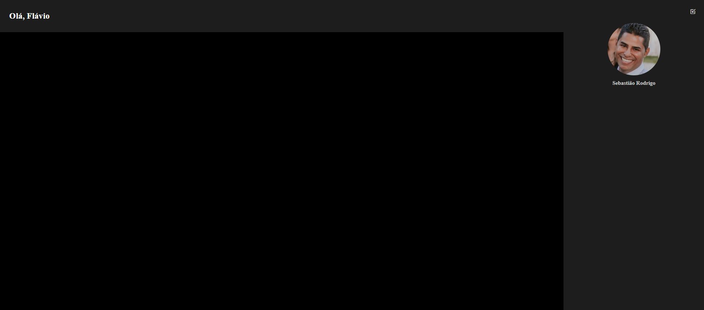

#### Projeto Drawer Menu

> * HTML5
> * CSS3
> * Javascript
> * Bootstrap Icons FontWasome

#### Telas prontas

* mobile

<table align="center">
  <tr>
    <td align="center">
      <strong>Menu Aberto</strong> 
      
    </td>
    <td align="center">
      <strong>Menu Fechado</strong> 
      
    </td>
  </tr>
</table>
